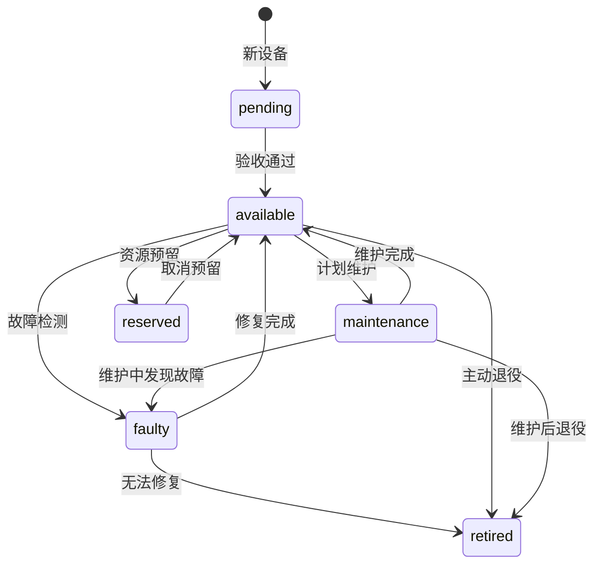

# 设备状态管理

> 所属模块：模块 1 - CMDB 设备管理模块
>
> 功能编号：2.1-2.4
>
> 优先级：P0（必须）

---

## 1. 功能概述

### 1.1 功能描述

设备状态管理是 CMDB 的核心功能，负责管理设备的运营状态、使用状态和健康状态，确保状态转换的合法性和一致性，为资源调度提供准确的设备可用性信息。

### 1.2 业务价值

- ✅ 统一的设备状态模型，避免状态混乱
- ✅ 状态转换规则校验，防止非法操作
- ✅ 自动健康检测，及时发现设备异常
- ✅ 状态变更通知，及时告知相关人员

### 1.3 状态维度

系统采用三维状态模型：

```yaml
状态维度:
  1. 运营状态 (Operational Status):
     - 描述: 设备是否可用于业务
     - 取值: available, maintenance, faulty, retired, reserved

  2. 使用状态 (Usage Status):
     - 描述: 设备资源占用情况
     - 取值: idle, partial, full, overcommit

  3. 健康状态 (Health Status):
     - 描述: 设备健康程度
     - 取值: healthy, degraded, unhealthy, unknown
```

---

## 2. 运营状态管理

### 2.1 状态定义

| 状态 | 英文 | 说明 | 可否分配 | 典型场景 |
|------|------|------|---------|---------|
| 可用 | available | 设备正常，可分配资源 | ✅ 是 | 设备上线后的正常状态 |
| 维护中 | maintenance | 计划内维护，不可分配 | ❌ 否 | 定期硬件维护、系统升级 |
| 故障 | faulty | 设备故障，需要修复 | ❌ 否 | 硬件故障、系统崩溃 |
| 已退役 | retired | 设备下线，不再使用 | ❌ 否 | 设备报废、性能不足 |
| 预留 | reserved | 为特定用户/项目预留 | ❌ 否 | VIP 用户专用、项目专用 |

### 2.2 状态转换规则



**转换规则表：**

| 当前状态 | 目标状态 | 前置条件 | 是否需要审批 |
|---------|---------|---------|-------------|
| pending | available | 验收测试通过 | 否 |
| available | maintenance | 无运行中的环境 | 是 |
| available | faulty | - | 否（自动） |
| available | reserved | - | 是 |
| available | retired | 无运行中的环境 | 是 |
| maintenance | available | 维护任务完成 | 否 |
| maintenance | faulty | - | 否 |
| faulty | available | 修复验证通过 | 否 |
| faulty | retired | - | 是 |
| reserved | available | - | 是 |

### 2.3 状态转换实现

```go
// 状态转换管理器
type StateTransitionManager struct {
    db *gorm.DB
}

// 状态转换请求
type TransitionRequest struct {
    AssetID      string
    FromStatus   string
    ToStatus     string
    Reason       string
    Operator     string
    ApprovalID   string  // 审批单 ID（如需审批）
}

// 执行状态转换
func (m *StateTransitionManager) Transition(req TransitionRequest) error {
    // 1. 验证转换是否合法
    if !m.isValidTransition(req.FromStatus, req.ToStatus) {
        return errors.New("非法的状态转换")
    }

    // 2. 检查前置条件
    if err := m.checkPreconditions(req); err != nil {
        return err
    }

    // 3. 检查是否需要审批
    if m.requiresApproval(req.FromStatus, req.ToStatus) {
        if req.ApprovalID == "" {
            return errors.New("该状态转换需要审批")
        }
        // 验证审批单
        if !m.isApprovalValid(req.ApprovalID) {
            return errors.New("审批单无效或未通过")
        }
    }

    // 4. 执行转换
    return m.db.Transaction(func(tx *gorm.DB) error {
        // 更新资产状态
        if err := tx.Model(&Asset{}).
            Where("id = ? AND operational_status = ?", req.AssetID, req.FromStatus).
            Update("operational_status", req.ToStatus).Error; err != nil {
            return err
        }

        // 记录变更历史
        changeLog := &ChangeLog{
            AssetID:    req.AssetID,
            ChangeType: "status_change",
            FieldName:  "operational_status",
            OldValue:   req.FromStatus,
            NewValue:   req.ToStatus,
            Reason:     req.Reason,
            Operator:   req.Operator,
        }
        if err := tx.Create(changeLog).Error; err != nil {
            return err
        }

        // 发送通知
        m.sendNotification(req)

        return nil
    })
}

// 检查前置条件
func (m *StateTransitionManager) checkPreconditions(req TransitionRequest) error {
    // 转换到维护或退役状态时，检查是否有运行中的环境
    if req.ToStatus == "maintenance" || req.ToStatus == "retired" {
        var count int64
        m.db.Model(&Environment{}).
            Where("host_id = ? AND status = 'running'", req.AssetID).
            Count(&count)

        if count > 0 {
            return fmt.Errorf("设备上还有 %d 个运行中的环境，无法转换状态", count)
        }
    }

    return nil
}
```

### 2.4 状态变更通知

**通知渠道：**
- 邮件通知
- 钉钉/企业微信通知
- 系统内消息

**通知规则：**

| 状态变更 | 通知对象 | 通知内容 |
|---------|---------|---------|
| available → maintenance | 设备负责人、运维团队 | 设备进入维护，预计维护时间 |
| available → faulty | 设备负责人、运维团队、告警组 | 设备故障，需要紧急处理 |
| faulty → available | 设备负责人、运维团队 | 设备修复完成，已恢复可用 |
| * → retired | 设备负责人、运维团队、财务 | 设备已退役 |

---

## 3. 使用状态管理

### 3.1 状态定义

| 状态 | 英文 | 资源占用率 | 说明 |
|------|------|-----------|------|
| 空闲 | idle | 0% | 无资源被占用 |
| 部分使用 | partial | 1-99% | 部分资源被占用 |
| 完全使用 | full | 100% | 资源已全部分配 |
| 超分配 | overcommit | >100% | 允许超分配场景 |

### 3.2 资源使用率计算

```go
// 计算资源使用率
func CalculateUsageStatus(host *Host) string {
    // 计算 CPU 使用率
    cpuUsage := float64(host.UsedCPU) / float64(host.TotalCPU) * 100

    // 计算内存使用率
    memoryUsage := float64(host.UsedMemory) / float64(host.TotalMemory) * 100

    // 计算 GPU 使用率
    gpuUsage := float64(host.UsedGPU) / float64(host.TotalGPU) * 100

    // 取最大值作为整体使用率
    maxUsage := math.Max(cpuUsage, math.Max(memoryUsage, gpuUsage))

    // 判断状态
    if maxUsage == 0 {
        return "idle"
    } else if maxUsage < 100 {
        return "partial"
    } else if maxUsage == 100 {
        return "full"
    } else {
        return "overcommit"
    }
}
```

### 3.3 资源水位告警

**告警规则：**

| 资源类型 | 告警阈值 | 告警级别 | 处理建议 |
|---------|---------|---------|---------|
| CPU | > 80% | Warning | 考虑扩容或迁移环境 |
| CPU | > 95% | Critical | 立即扩容或限流 |
| 内存 | > 80% | Warning | 考虑扩容 |
| 内存 | > 90% | Critical | 立即扩容，可能触发 OOM |
| GPU | > 90% | Warning | GPU 资源紧张 |
| 磁盘 | > 80% | Warning | 清理磁盘或扩容 |
| 磁盘 | > 90% | Critical | 立即清理，可能影响服务 |

---

## 4. 健康状态监测

### 4.1 状态定义

| 状态 | 英文 | 说明 | 影响 |
|------|------|------|------|
| 健康 | healthy | 所有指标正常 | 可正常分配资源 |
| 降级 | degraded | 部分指标异常 | 可分配资源，但需关注 |
| 不健康 | unhealthy | 严重异常 | 不可分配资源 |
| 未知 | unknown | 无法获取状态 | 不可分配资源 |

### 4.2 健康检查项

```yaml
健康检查项:
  1. 心跳检测:
     - 检查频率: 每 30 秒
     - 超时阈值: 60 秒
     - 异常判定: 连续 2 次超时标记为 unhealthy

  2. 磁盘空间:
     - 检查频率: 每 5 分钟
     - Warning: 可用空间 < 20%
     - Critical: 可用空间 < 10%

  3. 内存可用:
     - 检查频率: 每 1 分钟
     - Warning: 可用内存 < 10%
     - Critical: 可用内存 < 5%

  4. 系统负载:
     - 检查频率: 每 1 分钟
     - Warning: Load Average > CPU 核心数 * 0.8
     - Critical: Load Average > CPU 核心数 * 1.5

  5. GPU 温度:
     - 检查频率: 每 30 秒
     - Warning: 温度 > 80°C
     - Critical: 温度 > 85°C

  6. GPU 功耗:
     - 检查频率: 每 30 秒
     - Warning: 功耗 > 额定功率 * 1.0
     - Critical: 功耗 > 额定功率 * 1.1
```

### 4.3 健康检查实现

```go
// 健康检查器
type HealthChecker struct {
    db *gorm.DB
}

// 执行健康检查
func (h *HealthChecker) CheckHost(hostID string) (*HealthCheckResult, error) {
    var host Host
    if err := h.db.Where("id = ?", hostID).First(&host).Error; err != nil {
        return nil, err
    }

    result := &HealthCheckResult{
        HostID:    hostID,
        Status:    "healthy",
        Issues:    []HealthIssue{},
        CheckedAt: time.Now(),
    }

    // 1. 检查心跳
    if time.Since(host.LastHeartbeat) > 60*time.Second {
        result.Issues = append(result.Issues, HealthIssue{
            Type:     "heartbeat",
            Severity: "critical",
            Message:  "心跳超时",
        })
        result.Status = "unhealthy"
    }

    // 2. 检查磁盘空间
    var metrics HostMetric
    h.db.Where("host_id = ?", hostID).
        Order("collected_at DESC").
        First(&metrics)

    if metrics.DiskUsagePercent > 90 {
        result.Issues = append(result.Issues, HealthIssue{
            Type:     "disk",
            Severity: "critical",
            Message:  fmt.Sprintf("磁盘使用率 %.1f%%", metrics.DiskUsagePercent),
        })
        result.Status = "unhealthy"
    } else if metrics.DiskUsagePercent > 80 {
        result.Issues = append(result.Issues, HealthIssue{
            Type:     "disk",
            Severity: "warning",
            Message:  fmt.Sprintf("磁盘使用率 %.1f%%", metrics.DiskUsagePercent),
        })
        if result.Status == "healthy" {
            result.Status = "degraded"
        }
    }

    // 3. 检查内存
    memoryAvailablePercent := float64(metrics.MemoryAvailable) / float64(host.TotalMemory) * 100
    if memoryAvailablePercent < 5 {
        result.Issues = append(result.Issues, HealthIssue{
            Type:     "memory",
            Severity: "critical",
            Message:  fmt.Sprintf("可用内存仅 %.1f%%", memoryAvailablePercent),
        })
        result.Status = "unhealthy"
    }

    // 4. 检查 GPU 健康
    var gpus []GPU
    h.db.Where("host_id = ?", hostID).Find(&gpus)

    for _, gpu := range gpus {
        if !h.checkGPUHealth(gpu.ID) {
            result.Issues = append(result.Issues, HealthIssue{
                Type:     "gpu",
                Severity: "warning",
                Message:  fmt.Sprintf("GPU %d 异常", gpu.GPUIndex),
            })
            if result.Status == "healthy" {
                result.Status = "degraded"
            }
        }
    }

    // 5. 更新主机健康状态
    h.db.Model(&host).Update("health_status", result.Status)

    // 6. 如果状态异常，发送告警
    if result.Status != "healthy" {
        h.sendAlert(result)
    }

    return result, nil
}
```

### 4.4 自动隔离机制

**隔离规则：**
- 健康状态为 `unhealthy` 时，自动标记为不可分配
- 连续 3 次健康检查失败，自动将运营状态改为 `faulty`
- 自动通知运维团队处理

```go
// 自动隔离不健康设备
func (h *HealthChecker) AutoIsolate(hostID string, result *HealthCheckResult) {
    if result.Status == "unhealthy" {
        // 记录失败次数
        failCount := h.incrementFailCount(hostID)

        // 连续 3 次失败，自动标记为故障
        if failCount >= 3 {
            h.db.Model(&Host{}).
                Where("id = ?", hostID).
                Update("operational_status", "faulty")

            // 创建故障工单
            h.createFaultTicket(hostID, result)
        }
    } else {
        // 恢复时重置失败计数
        h.resetFailCount(hostID)
    }
}
```

---

## 5. API 接口

### 5.1 更新运营状态

```go
// PUT /api/cmdb/assets/:id/operational-status
func UpdateOperationalStatus(c *gin.Context) {
    assetID := c.Param("id")

    var req struct {
        Status     string `json:"status" binding:"required"`
        Reason     string `json:"reason" binding:"required"`
        ApprovalID string `json:"approval_id"`
    }

    if err := c.ShouldBindJSON(&req); err != nil {
        c.JSON(400, gin.H{"error": err.Error()})
        return
    }

    operator := GetCurrentUser(c)

    // 获取当前状态
    var asset Asset
    if err := db.Where("id = ?", assetID).First(&asset).Error; err != nil {
        c.JSON(404, gin.H{"error": "资产不存在"})
        return
    }

    // 执行状态转换
    transitionReq := TransitionRequest{
        AssetID:    assetID,
        FromStatus: asset.OperationalStatus,
        ToStatus:   req.Status,
        Reason:     req.Reason,
        Operator:   operator.Username,
        ApprovalID: req.ApprovalID,
    }

    if err := stateManager.Transition(transitionReq); err != nil {
        c.JSON(400, gin.H{"error": err.Error()})
        return
    }

    c.JSON(200, gin.H{"status": "success"})
}
```

### 5.2 查询健康状态

```go
// GET /api/cmdb/hosts/:id/health
func GetHostHealth(c *gin.Context) {
    hostID := c.Param("id")

    result, err := healthChecker.CheckHost(hostID)
    if err != nil {
        c.JSON(500, gin.H{"error": err.Error()})
        return
    }

    c.JSON(200, result)
}
```

---

## 6. 前端界面

### 6.1 状态管理页面

**功能要求：**
```vue
<template>
  <el-card>
    <h3>设备状态管理</h3>

    <!-- 状态概览 -->
    <el-row :gutter="20">
      <el-col :span="6">
        <el-statistic title="可用设备" :value="stats.available" />
      </el-col>
      <el-col :span="6">
        <el-statistic title="维护中" :value="stats.maintenance" />
      </el-col>
      <el-col :span="6">
        <el-statistic title="故障设备" :value="stats.faulty" />
      </el-col>
      <el-col :span="6">
        <el-statistic title="已退役" :value="stats.retired" />
      </el-col>
    </el-row>

    <!-- 状态转换操作 -->
    <el-button @click="showTransitionDialog">变更状态</el-button>

    <!-- 状态转换对话框 -->
    <el-dialog v-model="dialogVisible" title="状态转换">
      <el-form :model="form">
        <el-form-item label="目标状态">
          <el-select v-model="form.status">
            <el-option label="可用" value="available" />
            <el-option label="维护中" value="maintenance" />
            <el-option label="故障" value="faulty" />
            <el-option label="已退役" value="retired" />
          </el-select>
        </el-form-item>

        <el-form-item label="变更原因">
          <el-input v-model="form.reason" type="textarea" />
        </el-form-item>
      </el-form>

      <template #footer>
        <el-button @click="dialogVisible = false">取消</el-button>
        <el-button type="primary" @click="submitTransition">确定</el-button>
      </template>
    </el-dialog>
  </el-card>
</template>
```

---

## 7. 测试用例

| 用例编号 | 测试场景 | 预期结果 |
|---------|---------|---------|
| TC-01 | available → maintenance（有运行环境） | 转换失败，提示有运行环境 |
| TC-02 | available → maintenance（无运行环境） | 转换成功 |
| TC-03 | 心跳超时 | 健康状态变为 unhealthy |
| TC-04 | 磁盘使用率 > 90% | 健康状态变为 unhealthy |
| TC-05 | GPU 温度 > 85°C | 健康状态变为 degraded |

---

**文档版本：** v1.0
**创建日期：** 2026-01-26
