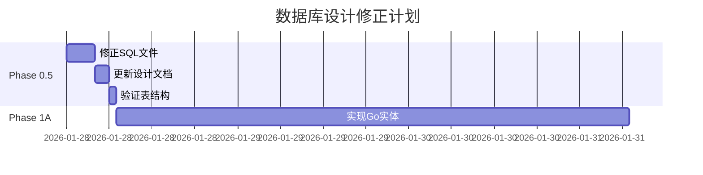

# RemoteGPU 平台需求与数据库设计分析报告

> 本报告分析RemoteGPU平台的核心定位、需求与数据库设计的匹配度，并提出改进建议
>
> **创建日期**: 2026-01-28
> **分析范围**: 需求文档 + 数据库设计 + SQL表结构
> **版本**: 1.0

---

## 📋 执行摘要

### 分析结论

**平台定位:** GPU/NPU云平台，对标趋动云（VirtAI Cloud），提供开发环境、训练、推理三大核心功能

**数据库设计评估:**
- ✅ **整体架构合理** - 多租户架构清晰，表关系设计良好
- ⚠️ **字段设计不足** - 缺少关键业务字段，无法支持核心需求
- ❌ **多挂载需求未实现** - 数据集/模型只支持单个挂载
- ❌ **工作空间计费缺失** - 计费表缺少workspace_id维度

**关键问题数量:**
- 🔴 严重问题: 5个（阻塞核心功能）
- 🟡 中等问题: 8个（影响用户体验）
- 🟢 轻微问题: 3个（优化建议）

**建议行动:**
1. **立即修复** - environments表、training_jobs表、billing_records表
2. **优先实现** - 多挂载支持、工作空间计费
3. **后续优化** - 推理服务扩缩容、端口生命周期管理

---

## 1. 平台定位分析

### 1.1 核心定位

**RemoteGPU = GPU/NPU云平台 + AI开发全流程支持**

```
用户价值主张
├─ 快速环境创建 (<2分钟)
├─ 多种访问方式 (SSH/JupyterLab/Web Terminal/VSCode)
├─ 灵活资源调度 (GPU虚拟化、动态分配)
└─ 按量计费 (分钟级、工作空间维度)
```

### 1.2 对标平台

**参考平台:** 趋动云（VirtAI Cloud）

**核心特性对比:**

| 特性 | 趋动云 | RemoteGPU目标 | 当前实现 |
|------|--------|--------------|---------|
| 多租户架构 | ✅ | ✅ | ✅ |
| 工作空间管理 | ✅ | ✅ | ⚠️ 部分 |
| 快速环境创建 | ✅ <2分钟 | ✅ <2分钟 | ❓ 待实现 |
| 多种访问方式 | ✅ 4种 | ✅ 4种 | ❌ 只设计SSH |
| 数据集挂载 | ✅ 最多3个 | ✅ 最多3个 | ❌ 只支持1个 |
| 分布式训练 | ✅ | ✅ | ❌ 未设计 |
| 推理服务 | ✅ 扩缩容 | ✅ 扩缩容 | ❓ 待确认 |
| 工作空间计费 | ✅ | ✅ | ❌ 缺失 |

### 1.3 三大核心功能

#### 功能1: 开发环境 (Development)

**需求要点:**
- JupyterLab在线开发
- SSH远程接入（动态端口）
- Web Terminal（xterm.js）
- TensorBoard可视化
- 代码目录持久化（`/gemini/code/`）
- 数据集/模型挂载（最多各3个）

**数据库支持度:** ⚠️ 40%
- ✅ 基础字段存在（cpu, memory, gpu, ssh_port）
- ❌ 缺少JupyterLab配置
- ❌ 缺少挂载配置
- ❌ 缺少环境变量配置

#### 功能2: 训练系统 (Training)

**需求要点:**
- 单机/分布式训练
- 数据集挂载（最多3个）
- 模型挂载（最多3个）
- 任务队列（配额队列+资源队列）
- 分布式框架支持（Horovod/PyTorch DDP）

**数据库支持度:** ⚠️ 50%
- ✅ 基础字段存在（status, priority, resources）
- ❌ 只支持单个数据集/模型
- ❌ 缺少分布式配置
- ❌ 缺少队列状态

#### 功能3: 推理服务 (Inference)

**需求要点:**
- 副本数量配置
- 自动扩缩容
- 端口生命周期管理（48小时）
- 服务升级/回滚
- 健康检查

**数据库支持度:** ❓ 待确认
- ✅ 基础字段存在
- ❓ 副本数量字段？
- ❓ 扩缩容配置？
- ❓ 版本管理？

---

## 2. 核心需求清单

### 2.1 多租户架构需求

| 需求项 | 优先级 | 数据库支持 | 缺失内容 |
|--------|--------|-----------|---------|
| 工作空间管理 | 🔴 高 | ✅ 有表 | ⚠️ 角色字段不明确 |
| 成员管理 | 🔴 高 | ✅ 有表 | ⚠️ 角色枚举需确认 |
| 资源配额 | 🔴 高 | ✅ 有表 | ✅ 完整 |
| 工作空间计费 | 🔴 高 | ❌ 缺失 | workspace_id字段 |

### 2.2 环境管理需求

| 需求项 | 优先级 | 数据库支持 | 缺失内容 |
|--------|--------|-----------|---------|
| SSH访问 | 🔴 高 | ✅ 有字段 | ✅ ssh_port |
| JupyterLab | 🔴 高 | ❌ 缺失 | jupyterlab_port, token |
| Web Terminal | 🟡 中 | ❌ 缺失 | web_terminal_enabled |
| TensorBoard | 🟡 中 | ❌ 缺失 | tensorboard_port |
| 数据集挂载(3个) | 🔴 高 | ❌ 缺失 | mounted_datasets JSONB |
| 模型挂载(3个) | 🔴 高 | ❌ 缺失 | mounted_models JSONB |
| 环境变量 | 🔴 高 | ❌ 缺失 | env_vars JSONB |
| GPU显存配置 | 🟡 中 | ❌ 缺失 | gpu_memory |
| 临时存储 | 🟡 中 | ❌ 缺失 | temp_storage |

### 2.3 训练系统需求

| 需求项 | 优先级 | 数据库支持 | 缺失内容 |
|--------|--------|-----------|---------|
| 数据集挂载(3个) | 🔴 高 | ❌ 单个 | mounted_datasets JSONB |
| 模型挂载(3个) | 🔴 高 | ❌ 单个 | mounted_models JSONB |
| 分布式训练 | 🔴 高 | ❌ 缺失 | node_count, distributed_config |
| 镜像选择 | 🔴 高 | ❌ 缺失 | image字段 |
| 环境变量 | 🔴 高 | ❌ 缺失 | env_vars JSONB |
| 启动命令 | 🔴 高 | ⚠️ 部分 | script_path → command |
| 任务队列状态 | 🟡 中 | ⚠️ 部分 | status需包含"queued" |

### 2.4 计费系统需求

| 需求项 | 优先级 | 数据库支持 | 缺失内容 |
|--------|--------|-----------|---------|
| 工作空间计费 | 🔴 高 | ❌ 缺失 | workspace_id |
| 分钟级计费 | 🔴 高 | ❌ 缺失 | billing_unit, billing_minutes |
| 存储单独计费 | 🟡 中 | ⚠️ 部分 | resource_type需明确 |
| 欠费处理 | 🟡 中 | ❌ 缺失 | 需要customers表增加余额字段 |

---

## 3. 数据库设计问题详解

### 3.1 🔴 严重问题

#### 问题1: environments表缺少关键访问配置

**影响:** 无法支持JupyterLab、Web Terminal、TensorBoard等核心功能

**当前设计:**
```sql
CREATE TABLE environments (
    id VARCHAR(64) PRIMARY KEY,
    ssh_port INT,  -- 只有SSH端口
    ...
);
```

**需要增加:**
```sql
-- 访问配置
jupyterlab_port INT,
jupyterlab_token VARCHAR(128),
jupyterlab_enabled BOOLEAN DEFAULT true,
tensorboard_port INT,
tensorboard_enabled BOOLEAN DEFAULT false,
web_terminal_enabled BOOLEAN DEFAULT true,

-- 挂载配置
mounted_datasets JSONB,  -- [{"id": 1, "path": "/gemini/data-1", "readonly": true}]
mounted_models JSONB,    -- [{"id": 1, "path": "/gemini/pretrain1", "readonly": true}]

-- 环境配置
env_vars JSONB,          -- {"PYTHONPATH": "/gemini/code", "CUDA_VISIBLE_DEVICES": "0"}
config JSONB,            -- 其他配置

-- 资源配置
gpu_memory BIGINT,       -- GPU显存(字节)
temp_storage BIGINT,     -- 临时存储(字节)

-- 标准字段
updated_at TIMESTAMP DEFAULT NOW(),
deleted_at TIMESTAMP     -- 软删除
```

**优先级:** 🔴 最高（阻塞核心功能）

---

#### 问题2: training_jobs表不支持多挂载

**影响:** 无法满足"最多挂载3个数据集/模型"的核心需求

**当前设计:**
```sql
CREATE TABLE training_jobs (
    dataset_id BIGINT,  -- 只能挂载1个
    model_id BIGINT,    -- 只能挂载1个
    ...
);
```

**需要修改:**
```sql
-- 删除单个字段
-- dataset_id BIGINT,
-- model_id BIGINT,

-- 增加多挂载支持
mounted_datasets JSONB,  -- [1, 2, 3] 最多3个
mounted_models JSONB,    -- [1, 2] 最多3个

-- 分布式训练配置
image VARCHAR(256) NOT NULL,
node_count INT DEFAULT 1,
distributed_config JSONB,  -- {"framework": "pytorch", "backend": "nccl", "master_addr": "..."}

-- 环境配置
env_vars JSONB,
command TEXT NOT NULL,     -- 启动命令（替代script_path）

-- 输出配置
output_path VARCHAR(512) DEFAULT '/gemini/output/'
```

**优先级:** 🔴 最高（阻塞核心功能）

---

#### 问题3: billing_records表缺少工作空间维度

**影响:** 无法实现"工作空间维度计费"的核心需求

**当前设计:**
```sql
CREATE TABLE billing_records (
    customer_id BIGINT NOT NULL,
    env_id VARCHAR(64),
    ...
);
```

**需要增加:**
```sql
-- 工作空间维度（核心）
workspace_id BIGINT,  -- 工作空间计费

-- 计费粒度
billing_unit VARCHAR(20) DEFAULT 'minute',  -- 'minute', 'hour', 'day'
billing_minutes INT,                         -- 计费分钟数（向上取整）

-- 资源关联
resource_id VARCHAR(64),    -- 可以是env_id, training_job_id, inference_service_id
resource_type VARCHAR(32),  -- 'environment', 'training', 'inference', 'storage'
resource_name VARCHAR(256)
```

**优先级:** 🔴 最高（核心业务逻辑）

---

#### 问题4: customers表缺少账户余额字段

**影响:** 无法实现充值、扣费、欠费处理等计费功能

**需要增加:**
```sql
-- 账户余额
balance DECIMAL(10,4) DEFAULT 0.00,
currency VARCHAR(10) DEFAULT 'CNY',

-- 欠费状态
overdue_status VARCHAR(20) DEFAULT 'normal',  -- 'normal', 'overdue', 'suspended'
overdue_since TIMESTAMP,                       -- 欠费开始时间
last_payment_at TIMESTAMP                      -- 最后充值时间
```

**优先级:** 🔴 高（计费系统必需）

---

#### 问题5: inference_services表缺少扩缩容配置

**影响:** 无法实现自动扩缩容功能

**需要增加:**
```sql
-- 副本配置
replicas INT DEFAULT 1,
min_replicas INT DEFAULT 1,
max_replicas INT DEFAULT 10,

-- 扩缩容配置
autoscaling_enabled BOOLEAN DEFAULT false,
autoscaling_config JSONB,  -- {"target_cpu": 80, "target_qps": 1000}

-- 版本管理（支持回滚）
version VARCHAR(64),
previous_version VARCHAR(64),

-- 健康检查
health_check_path VARCHAR(256),
health_check_interval INT DEFAULT 30  -- 秒
```

**优先级:** 🔴 高（核心功能）

---

### 3.2 🟡 中等问题

#### 问题6: port_mappings表缺少生命周期管理

**需求:** 端口48小时不活动自动释放

**需要增加:**
```sql
last_accessed_at TIMESTAMP,
auto_release_hours INT DEFAULT 48,
released_at TIMESTAMP
```

#### 问题7: workspaces表角色定义不明确

**需求:** Owner/Admin/Member三种角色

**需要确认:** workspace_members表的role字段枚举值

#### 问题8: datasets/models表缺少标签系统

**需求:** 数据集/模型标签管理

**需要增加:**
```sql
tags JSONB  -- ["nlp", "bert", "chinese"]
```

---

### 3.3 🟢 轻微问题

#### 问题9: 缺少统一的软删除支持

**建议:** 所有核心业务表增加deleted_at字段

#### 问题10: 缺少审计日志关联

**建议:** 关键操作记录到audit_logs表

---

## 4. 改进建议

### 4.1 立即修复（Phase 0.5 - 1天）

**在Phase 1A之前完成数据库设计修正**

| 表名 | 修改内容 | 工作量 |
|------|---------|--------|
| environments | 增加10+字段 | 2小时 |
| training_jobs | 修改挂载字段，增加分布式配置 | 2小时 |
| billing_records | 增加工作空间维度 | 1小时 |
| customers | 增加余额字段 | 1小时 |
| inference_services | 增加扩缩容配置 | 1小时 |

**输出:** 更新后的SQL文件 + 更新后的数据库设计文档

---

### 4.2 优先级排序

#### P0 - 阻塞核心功能（必须立即修复）

1. **environments表** - 增加访问配置和挂载配置
2. **training_jobs表** - 支持多挂载
3. **billing_records表** - 增加工作空间维度
4. **customers表** - 增加余额字段

#### P1 - 影响用户体验（Phase 1完成前修复）

5. **inference_services表** - 增加扩缩容配置
6. **port_mappings表** - 增加生命周期管理
7. **workspaces表** - 明确角色定义

#### P2 - 优化建议（Phase 2-3实现）

8. 统一软删除支持
9. 标签系统
10. 审计日志关联

---

### 4.3 实施计划



---

## 5. 验证清单

### 5.1 SQL文件修正清单

- [ ] `05_environments.sql` - 增加10+字段
- [ ] `09_training_and_inference.sql` - 修改training_jobs和inference_services
- [ ] `08_billing.sql` - 修改billing_records
- [ ] `03_users_and_permissions.sql` - 修改customers表
- [ ] `05_environments.sql` - 修改port_mappings表

### 5.2 设计文档更新清单

- [ ] `database_design.md` - 更新所有修改的表
- [ ] `database_entity_classification.md` - 更新实体字段说明
- [ ] 创建字段变更说明文档

### 5.3 功能验证清单

- [ ] 环境管理：支持4种访问方式
- [ ] 训练系统：支持3个数据集+3个模型挂载
- [ ] 计费系统：支持工作空间维度计费
- [ ] 推理服务：支持副本配置和扩缩容

---

## 6. 风险评估

### 6.1 修改风险

| 风险项 | 影响 | 缓解措施 |
|--------|------|---------|
| 字段类型选择不当 | 🟡 中 | 参考趋动云实现，使用JSONB存储复杂配置 |
| 索引设计不合理 | 🟡 中 | 为JSONB字段创建GIN索引 |
| 迁移脚本错误 | 🔴 高 | 在测试环境充分验证 |

### 6.2 时间风险

**预计修正时间:** 1天（7小时）

**风险:** 如果不修正，Phase 1A实现的Go实体将不完整，Phase 2实现业务逻辑时需要返工

**建议:** 立即修正，避免后续返工

---

## 7. 总结

### 7.1 核心发现

1. **平台定位清晰** - 对标趋动云，目标明确
2. **数据库架构合理** - 多租户设计良好
3. **字段设计不足** - 缺少关键业务字段
4. **需要立即修正** - 5个严重问题阻塞核心功能

### 7.2 下一步行动

**立即行动（今天）:**
1. 修正5个关键表的SQL文件
2. 更新数据库设计文档
3. 验证表结构完整性

**Phase 1A（明天开始）:**
4. 基于修正后的设计实现Go实体
5. 确保实体字段完整支持需求

**Phase 2（下周）:**
6. 实现业务逻辑
7. 验证功能完整性

---

**文档维护者:** RemoteGPU开发团队
**最后更新:** 2026-01-28
