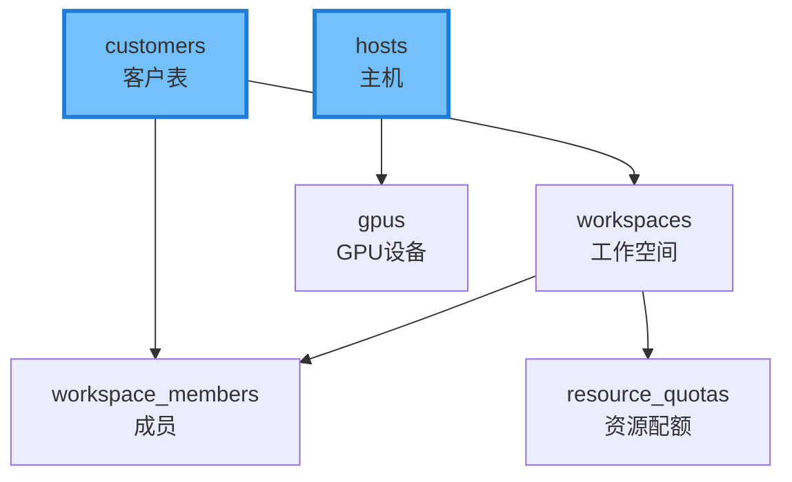
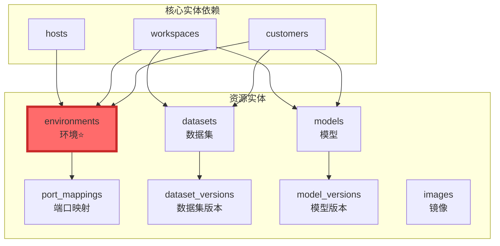
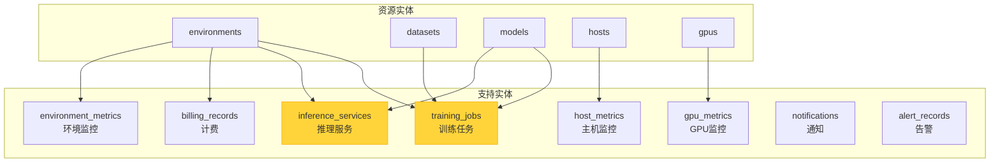
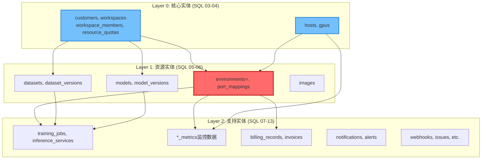
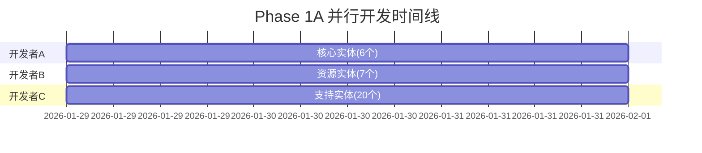

# RemoteGPU 数据库实体分类分析

> 本文档详细说明了RemoteGPU项目中数据库实体的分类方法、依赖关系和并行开发策略
>
> **创建日期**: 2026-01-28
> **版本**: 1.0

---

## 📋 执行摘要

RemoteGPU项目共有**33张数据库表**，为了支持高效的并行开发，我们将这些表对应的Go实体分为三大类：

| 分类 | 表数量 | SQL文件 | 开发优先级 | 可并行开发 |
|------|--------|---------|-----------|-----------|
| **核心实体** | 6张 | SQL 03-04 | 🔴 最高 | ✅ 是 |
| **资源实体** | 7张 | SQL 05-06 | 🔴 高 | ✅ 是 |
| **支持实体** | 20张 | SQL 07-13 | 🟡 中等 | ✅ 是 |

**关键优势:**
- 3名开发者可同时开发不同类别的实体
- 清晰的依赖层次，避免循环依赖
- 支持MVP快速迭代（优先实现核心+资源实体）

---

## 1. 核心实体 (Core Entities)

### 1.1 定义

**核心实体**是系统的基础架构实体，代表系统的"参与者"和"资源提供者"，是其他所有业务功能的基石。

### 1.2 包含的实体

| Go文件 | 数据库表 | SQL文件 | 说明 |
|--------|---------|---------|------|
| `internal/model/entity/user.go` | `customers` | 03 | 客户/用户表（已存在，需增强） |
| `internal/model/entity/workspace.go` | `workspaces` | 03 | 工作空间表 |
| `internal/model/entity/workspace_member.go` | `workspace_members` | 03 | 工作空间成员表 |
| `internal/model/entity/resource_quota.go` | `resource_quotas` | 03 | 资源配额表 |
| `internal/model/entity/host.go` | `hosts` | 04 | 物理主机表 |
| `internal/model/entity/gpu.go` | `gpus` | 04 | GPU设备表 |

### 1.3 特点

1. **SQL执行顺序最早** - 对应SQL脚本序号3和4，必须最先创建
2. **被大量引用** - 其他所有表都直接或间接依赖这些表
3. **无外部依赖** - customers和hosts表不依赖其他业务表
4. **代表系统基础** - 定义了"谁"（用户/工作空间）和"在哪里"（主机/GPU）

### 1.4 依赖关系



### 1.5 开发建议

**优先级:** 🔴 最高（阻塞所有其他模块）

**开发者分配:** 开发者A（后端负责人）

**实现顺序:**
1. 先实现 `customers` 和 `hosts`（无依赖）
2. 再实现 `workspaces` 和 `gpus`（依赖上一步）
3. 最后实现 `workspace_members` 和 `resource_quotas`

---

## 2. 资源实体 (Resource Entities)

### 2.1 定义

**资源实体**代表用户直接操作和管理的业务资源，是平台的核心价值所在。

### 2.2 包含的实体

| Go文件 | 数据库表 | SQL文件 | 说明 |
|--------|---------|---------|------|
| `internal/model/entity/environment.go` ⭐ | `environments` | 05 | 开发环境表（最核心） |
| `internal/model/entity/port_mapping.go` | `port_mappings` | 05 | 端口映射表 |
| `internal/model/entity/dataset.go` | `datasets` | 06 | 数据集表 |
| `internal/model/entity/dataset_version.go` | `dataset_versions` | 06 | 数据集版本表 |
| `internal/model/entity/model.go` | `models` | 06 | 模型表 |
| `internal/model/entity/model_version.go` | `model_versions` | 06 | 模型版本表 |
| `internal/model/entity/image.go` | `images` | 06 | Docker镜像表 |

### 2.3 特点

1. **用户直接操作** - 用户创建环境、上传数据集、管理模型
2. **平台核心价值** - 这些是用户付费使用的资源
3. **依赖核心实体** - 需要用户、工作空间、主机才能创建
4. **支持版本管理** - datasets和models支持多版本

### 2.4 依赖关系



### 2.5 开发建议

**优先级:** 🔴 高（核心业务功能）

**开发者分配:** 开发者B（基础设施工程师）

**实现顺序:**
1. **优先:** `environment.go`（最核心，依赖最多）
2. **其次:** `dataset.go`, `model.go`, `image.go`（可并行）
3. **最后:** `port_mapping.go`, `*_version.go`（依赖主表）

---

## 3. 支持实体 (Support Entities)

### 3.1 定义

**支持实体**提供监控、计费、通知等辅助功能，支撑业务运行但不是核心业务逻辑。

### 3.2 包含的实体（按功能分组）

#### 3.2.1 训练推理类
| Go文件 | 数据库表 | SQL文件 |
|--------|---------|---------|
| `internal/model/entity/training_job.go` | `training_jobs` | 09 |
| `internal/model/entity/inference_service.go` | `inference_services` | 09 |

#### 3.2.2 监控类
| Go文件 | 数据库表 | SQL文件 |
|--------|---------|---------|
| `internal/model/entity/host_metric.go` | `host_metrics` | 07 |
| `internal/model/entity/gpu_metric.go` | `gpu_metrics` | 07 |
| `internal/model/entity/environment_metric.go` | `environment_metrics` | 07 |

#### 3.2.3 计费类
| Go文件 | 数据库表 | SQL文件 |
|--------|---------|---------|
| `internal/model/entity/billing_record.go` | `billing_records` | 08 |
| `internal/model/entity/invoice.go` | `invoices` | 08 |

#### 3.2.4 通知告警类
| Go文件 | 数据库表 | SQL文件 |
|--------|---------|---------|
| `internal/model/entity/notification.go` | `notifications` | 10 |
| `internal/model/entity/alert_rule.go` | `alert_rules` | 11 |
| `internal/model/entity/alert_record.go` | `alert_records` | 11 |

#### 3.2.5 Webhook类
| Go文件 | 数据库表 | SQL文件 |
|--------|---------|---------|
| `internal/model/entity/webhook.go` | `webhooks` | 11 |
| `internal/model/entity/webhook_log.go` | `webhook_logs` | 11 |

#### 3.2.6 工单类
| Go文件 | 数据库表 | SQL文件 |
|--------|---------|---------|
| `internal/model/entity/issue.go` | `issues` | 12 |
| `internal/model/entity/requirement.go` | `requirements` | 12 |
| `internal/model/entity/comment.go` | `comments` | 12 |

#### 3.2.7 其他
| Go文件 | 数据库表 | SQL文件 |
|--------|---------|---------|
| `internal/model/entity/audit_log.go` | `audit_logs` | 10 |
| `internal/model/entity/artifact.go` | `artifacts` | 13 |
| `internal/model/entity/dataset_usage.go` | `dataset_usage` | 13 |

### 3.3 特点

1. **辅助功能** - 不是核心业务，但提供重要支撑
2. **依赖资源实体** - 需要环境、数据集、模型等已存在
3. **可延后实现** - MVP阶段可以不包含这些功能
4. **数据量大** - 监控类表会产生大量时序数据

### 3.4 依赖关系



### 3.5 开发建议

**优先级:** 🟡 中等（可延后到MVP后）

**开发者分配:** 开发者C（资源管理工程师）

**实现顺序:**
1. **Phase 1:** 训练推理类（依赖环境+数据集+模型）
2. **Phase 2:** 监控类（依赖主机+GPU+环境）
3. **Phase 3:** 计费类（依赖环境）
4. **Phase 4:** 通知告警类（依赖用户+监控）
5. **Phase 5:** Webhook和工单类（依赖用户）

---

## 4. 整体依赖层次

### 4.1 三层架构



### 4.2 SQL执行顺序映射

| SQL序号 | SQL文件 | 实体分类 | 表数量 |
|---------|---------|---------|--------|
| 01 | `01_init_database.sql` | 初始化 | 0 |
| 02 | `02_system_config.sql` | 系统配置 | 1 |
| **03** | **`03_users_and_permissions.sql`** | **核心实体** | **4** |
| **04** | **`04_hosts_and_devices.sql`** | **核心实体** | **2** |
| **05** | **`05_environments.sql`** | **资源实体** | **2** |
| **06** | **`06_data_and_images.sql`** | **资源实体** | **6** |
| 07 | `07_monitoring.sql` | 支持实体 | 3 |
| 08 | `08_billing.sql` | 支持实体 | 2 |
| 09 | `09_training_and_inference.sql` | 支持实体 | 2 |
| 10 | `10_notifications_and_logs.sql` | 支持实体 | 2 |
| 11 | `11_alerts_and_webhooks.sql` | 支持实体 | 4 |
| 12 | `12_issues_and_requirements.sql` | 支持实体 | 3 |
| 13 | `13_relationships.sql` | 支持实体 | 2 |

---

## 5. 并行开发策略

### 5.1 Phase 1A: 数据库实体创建（第2-4天）

**可并行:** ✅ 是（3名开发者同时工作）



**为什么可以并行？**
- 在**实体定义阶段**，只需要定义Go结构体和GORM标签
- 不需要等待数据库表实际创建
- 到Phase 1B（数据库迁移）时，GORM会自动处理表创建顺序

### 5.2 开发者任务分配

#### 开发者A - 核心实体（6个文件）
```
internal/model/entity/
├── user.go (增强现有文件)
├── workspace.go
├── workspace_member.go
├── resource_quota.go
├── host.go
└── gpu.go
```

#### 开发者B - 资源实体（7个文件）
```
internal/model/entity/
├── environment.go ⭐ (最重要)
├── port_mapping.go
├── dataset.go
├── dataset_version.go
├── model.go
├── model_version.go
└── image.go
```

#### 开发者C - 支持实体（20个文件）
```
internal/model/entity/
├── training_job.go
├── inference_service.go
├── host_metric.go
├── gpu_metric.go
├── environment_metric.go
├── billing_record.go
├── invoice.go
├── notification.go
├── alert_rule.go
├── alert_record.go
├── webhook.go
├── webhook_log.go
├── issue.go
├── requirement.go
├── comment.go
├── audit_log.go
├── artifact.go
├── dataset_usage.go
└── system_config.go
```

---

## 6. MVP策略

### 6.1 MVP最小实体集

**目标:** 用户可以登录、创建环境、通过SSH访问

**必需实体（10个）:**

| 分类 | 实体 | 原因 |
|------|------|------|
| 核心 | customers | 用户登录必需 |
| 核心 | hosts | 环境需要主机 |
| 核心 | gpus | GPU资源分配 |
| 资源 | environments⭐ | 核心功能 |
| 资源 | port_mappings | SSH访问必需 |
| 资源 | images | 环境需要镜像 |

**可延后实体（27个）:**
- workspaces, workspace_members（团队协作功能）
- datasets, models（数据管理功能）
- training_jobs, inference_services（高级功能）
- 所有监控、计费、通知、告警实体

### 6.2 MVP开发时间线

```
Day 1: Phase 0 - 紧急修复 ✅
Day 2-4: 实现6个MVP实体
Day 5-6: 数据库迁移和测试
Day 7-9: 实现认证和用户模块
Day 10-13: 实现主机和环境模块（基础版）
Day 14-15: 集成测试

总计: 15天达到MVP
```

---

## 7. 关键文件清单

### 7.1 最关键的5个实体文件

1. **`internal/model/entity/environment.go`** ⭐⭐⭐
   - 最复杂的实体，包含最多外键
   - 依赖: customers, workspaces, hosts, images
   - 被依赖: training_jobs, inference_services, billing_records

2. **`internal/model/entity/host.go`** ⭐⭐⭐
   - 资源管理核心
   - 阻塞环境创建

3. **`internal/model/entity/user.go`** (customers) ⭐⭐⭐
   - 已存在，需要增强
   - 被所有业务模块依赖

4. **`internal/model/entity/workspace.go`** ⭐⭐
   - 团队协作基础
   - 被环境、数据集、模型依赖

5. **`internal/model/entity/dataset.go`** ⭐⭐
   - 训练任务必需
   - 支持版本管理

---

## 8. 注意事项

### 8.1 GORM标签规范

所有实体必须包含以下GORM标签：

```go
type Entity struct {
    ID        uint           `gorm:"primaryKey" json:"id"`
    CreatedAt time.Time      `json:"created_at"`
    UpdatedAt time.Time      `json:"updated_at"`
    DeletedAt gorm.DeletedAt `gorm:"index" json:"deleted_at,omitempty"`
}
```

### 8.2 外键关系

虽然SQL设计中减少了物理外键，但Go实体中仍需定义逻辑外键：

```go
type Environment struct {
    CustomerID   uint      `gorm:"not null;index" json:"customer_id"`
    Customer     Customer  `gorm:"foreignKey:CustomerID" json:"customer,omitempty"`

    WorkspaceID  *uint     `gorm:"index" json:"workspace_id"`
    Workspace    *Workspace `gorm:"foreignKey:WorkspaceID" json:"workspace,omitempty"`
}
```

### 8.3 JSON字段处理

对于JSONB字段，使用`datatypes.JSON`：

```go
import "gorm.io/datatypes"

type Environment struct {
    Config datatypes.JSON `gorm:"type:jsonb" json:"config"`
}
```

---

## 9. 验证清单

### 9.1 Phase 1A完成标准

- [ ] 所有33个实体文件已创建
- [ ] 所有实体包含基础字段（ID, CreatedAt, UpdatedAt）
- [ ] 外键关系正确定义
- [ ] GORM标签完整（primaryKey, index, foreignKey等）
- [ ] JSON标签符合API规范
- [ ] 代码通过`go build`编译

### 9.2 Phase 1B完成标准

- [ ] `cmd/main.go`的AutoMigrate包含所有33张表
- [ ] 数据库迁移成功执行
- [ ] 所有表创建成功（`\dt`查看）
- [ ] 外键约束正确（如果使用物理外键）
- [ ] 索引创建成功
- [ ] 种子数据插入成功

---

## 10. 参考资料

- [SQL脚本README](../../sql/README.md)
- [数据库设计文档](./database_design.md)
- [系统架构设计](./system_architecture.md)
- [开发路线图](../../PROJECT_COMPLETION_PLAN.md)

---

**文档维护者:** RemoteGPU开发团队
**最后更新:** 2026-01-28
