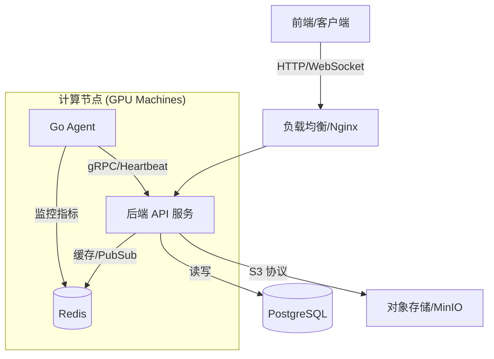

# RemoteGPU 后端需求文档

**版本**: v2.1
**日期**: 2026-02-03
**状态**: 待开发
**对接前端**: [前端需求文档 v1.0](./前端需求文档.md)

---

## 一、 项目愿景与技术栈

本系统旨在构建一个**企业级 GPU 算力整机分配平台**。后端作为核心枢纽，不仅要处理传统的 CRUD 业务，还需协调底层的 GPU 机器（Agent）、文件存储系统和即时通讯服务。

### 1.1 技术选型
*   **语言**: Go (Golang) 1.21+
*   **Web 框架**: Gin
*   **ORM**: GORM (v2)
*   **数据库**: PostgreSQL 14+ (必须支持 `uuid-ossp`, `pgcrypto` 扩展)
*   **缓存/队列**: Redis 7.0+ (用于 Session、任务队列、实时监控缓存)
*   **对象存储**: MinIO / Local FS (用于数据集、镜像存储)
*   **架构模式**: 清洁架构 (Clean Architecture) / 分层架构 (Controller -> Service -> DAO)

---

## 二、 系统架构设计

### 2.1 交互流程


### 2.2 核心模块划分
1.  **Core (核心域)**: 用户、租户、权限 (RBAC)。
2.  **Resource (资源域)**: 机器管理、GPU 资产、IP/网络池。
3.  **Allocation (调度域)**: 分配逻辑、租赁周期管理、回收流程。
4.  **Ops (运维域)**: 监控聚合、告警引擎、远程命令 (SSH/Jupyter)。
5.  **Data (数据域)**: 数据集管理、大文件分片上传、镜像仓库。

---

## 三、 API 接口详细清单与 Request/Response 示例

> 所有接口需遵循 RESTful 规范，响应体统一为 `{ code: 0, msg: "ok", data: {}, traceId: "..." }`。

### 3.1 认证模块 (Auth)

#### 3.1.1 登录
*   **POST** `/api/v1/auth/login`
*   **Request**:
    ```json
    {
      "username": "admin",
      "password": "password123"
    }
    ```
*   **Response**:
    ```json
    {
      "code": 0,
      "msg": "ok",
      "data": {
        "access_token": "eyJhbGciOiJIUzI1...",
        "refresh_token": "def50200...",
        "expires_in": 3600
      },
      "traceId": "t-12345"
    }
    ```

#### 3.1.2 刷新 Token
*   **POST** `/api/v1/auth/refresh`
*   **Request**:
    ```json
    {
      "refresh_token": "def50200..."
    }
    ```
*   **Response**:
    ```json
    {
      "code": 0,
      "msg": "ok",
      "data": {
        "access_token": "new_access_token...",
        "expires_in": 3600
      },
      "traceId": "t-67890"
    }
    ```

#### 3.1.3 获取用户信息
*   **GET** `/api/v1/auth/profile`
*   **Response**:
    ```json
    {
      "code": 0,
      "msg": "ok",
      "data": {
        "id": 1,
        "username": "admin",
        "role": "admin",
        "tenant_id": 0,
        "permissions": ["machine:read", "machine:write", "user:manage"]
      }
    }
    ```

### 3.2 管理员端 (Admin Context)

#### 3.2.1 仪表盘统计
*   **GET** `/api/v1/admin/dashboard/stats`
*   **Response**:
    ```json
    {
      "code": 0,
      "msg": "ok",
      "data": {
        "total_machines": 100,
        "online_machines": 95,
        "offline_machines": 5,
        "total_gpus": 400,
        "avg_gpu_utilization": 75.5,
        "allocation_rate": 80.0,
        "active_customers": 20,
        "active_alerts": 3
      }
    }
    ```

#### 3.2.2 机器列表
*   **GET** `/api/v1/admin/machines`
*   **Query**: `page=1&page_size=10&gpu_model=RTX 4090&status=online`
*   **Response**:
    ```json
    {
      "code": 0,
      "msg": "ok",
      "data": {
        "list": [
          {
            "id": "machine-001",
            "name": "bj-node-01",
            "region": "beijing",
            "status": "online",
            "allocation_status": "allocated",
            "ip": "192.168.1.10",
            "gpu_info": {
              "model": "NVIDIA GeForce RTX 4090",
              "count": 4,
              "memory": "24GB"
            },
            "cpu_info": "AMD EPYC 7543 32-Core",
            "memory_total": 256,
            "disk_total": 2048,
            "tenant_name": "Acme Corp"
          }
        ],
        "total": 50,
        "page": 1,
        "page_size": 10
      }
    }
    ```

#### 3.2.3 创建分配
*   **POST** `/api/v1/admin/allocations`
*   **Request**:
    ```json
    {
      "tenant_id": 5,
      "machine_ids": ["machine-001", "machine-002"],
      "duration_months": 3,
      "start_time": "2026-02-05T00:00:00Z",
      "remark": "VIP customer project A"
    }
    ```
*   **Response**:
    ```json
    {
      "code": 0,
      "msg": "ok",
      "data": {
        "allocation_ids": ["alloc-101", "alloc-102"]
      }
    }
    ```

#### 3.2.4 提前回收
*   **POST** `/api/v1/admin/machines/:id/reclaim`
*   **Request**:
    ```json
    {
      "reason": "Payment overdue",
      "force": false
    }
    ```
*   **Response**:
    ```json
    {
      "code": 0,
      "msg": "Reclaim process started",
      "data": {
        "task_id": "task-reclaim-999"
      }
    }
    ```

### 3.3 客户/租户端 (Customer Context)

#### 3.3.1 我的机器列表
*   **GET** `/api/v1/customer/machines`
*   **Response**:
    ```json
    {
      "code": 0,
      "msg": "ok",
      "data": [
        {
          "id": "machine-001",
          "name": "bj-node-01",
          "status": "online",
          "gpu_util": 85,
          "ssh_host": "ssh.remotegpu.com",
          "ssh_port": 10022,
          "ssh_user": "root",
          "jupyter_url": "http://jupyter.remotegpu.com/machine-001?token=xyz",
          "expires_at": "2026-05-05T00:00:00Z"
        }
      ]
    }
    ```

#### 3.3.2 初始化分片上传
*   **POST** `/api/v1/customer/datasets/init-multipart`
*   **Request**:
    ```json
    {
      "filename": "imagenet_train.tar.gz",
      "size": 150323855360,
      "md5": "a3f..."
    }
    ```
*   **Response**:
    ```json
    {
      "code": 0,
      "msg": "ok",
      "data": {
        "upload_id": "up-556677",
        "chunk_size": 5242880,
        "urls": [
          "https://minio.remotegpu.com/upload/chunk1?sig=...",
          "https://minio.remotegpu.com/upload/chunk2?sig=..."
        ]
      }
    }
    ```

#### 3.3.3 挂载数据集
*   **POST** `/api/v1/customer/datasets/:id/mount`
*   **Request**:
    ```json
    {
      "machine_id": "machine-001",
      "mount_point": "/data/imagenet",
      "read_only": true
    }
    ```
*   **Response**:
    ```json
    {
      "code": 0,
      "msg": "Mount command sent",
      "data": {
        "job_id": "job-mount-888"
      }
    }
    ```

---

## 四、 实时通信与 WebSocket 设计

为了满足前端“实时监控”和“日志流”需求，需建立标准 WebSocket 通道。

### 4.1 连接地址
`ws://host/ws/connect?token={JWT}`

### 4.2 协议格式 (JSON)
```json
// 客户端发送心跳
{ "type": "ping" }

// 服务端推送数据
{
  "type": "monitoring_update",
  "data": {
    "machine_id": "machine-01",
    "gpu_util": 85,
    "gpu_mem": 12288,
    "cpu_util": 40,
    "ts": 1700000000
  }
}
```

### 4.3 订阅机制
后端需根据用户角色自动订阅 Topic：
*   **管理员**: 订阅 `topic:global_monitoring` (全量数据，需降频处理，如 5s 推送一次快照)。
*   **客户**: 订阅 `topic:tenant_{id}_monitoring` (仅推送该租户的机器数据)。

---

## 五、 数据库核心 Schema (PostgreSQL)

基于 `sql/` 目录现有结构进行确认与补全。

### 5.1 关键实体关系
*   `tenants` (1) <-> (N) `users`
*   `machines` (1) <-> (0..1) `allocations` (当前活跃分配)
*   `machines` (1) <-> (N) `gpu_devices`
*   `datasets` (N) <-> (N) `machines` (通过 `dataset_mounts` 中间表)

### 5.2 状态机定义
*   **Machine Status**: `idle` (空闲) -> `allocated` (已分配) -> `maintenance` (维护中/重装中) -> `offline` (离线/失联)。
*   **Dataset Status**: `uploading` (上传中) -> `processing` (校验/解压中) -> `ready` (可用) -> `error`。

---

## 六、 关键业务逻辑实现细节

### 6.1 机器分配原子性
*   **场景**: 两个管理员同时分配同一台机器。
*   **方案**: 使用数据库事务 + 乐观锁 (Version字段) 或 状态机约束 (`UPDATE machines SET status='allocated' WHERE id=? AND status='idle'`)。确保 `RowsAffected > 0` 才继续后续流程。

### 6.2 Agent 心跳与存活检测
*   Agent 每 5-10 秒发送 HTTP/gRPC 心跳到后端。
*   后端将心跳时间戳写入 Redis `machine:heartbeat:{id}`。
*   启动一个定时任务 (Ticker)，每 30 秒扫描 Redis，若 `Now - LastHeartbeat > 30s`，则将数据库中该机器标记为 `offline` 并触发告警。

### 6.3 审计日志 (Audit Log)
*   **需求**: 记录所有敏感操作。
*   **中间件实现**: 在 Gin 中实现 `AuditMiddleware`，拦截 `POST/PUT/DELETE` 请求，记录 `UserID`, `IP`, `Path`, `Body`, `ResponseStatus` 到 `audit_logs` 表。

---

## 七、 开发阶段规划

### Phase 1: 基础底座 (Week 1)
*   [ ] 完成 PostgreSQL 数据库初始化与 GORM 模型映射。
*   [ ] 实现 JWT 认证中间件 (Access/Refresh Token)。
*   [ ] 完成 RBAC 权限控制中间件。
*   [ ] 实现机器 CRUD 和 Excel 导入接口。

### Phase 2: 分配与租户业务 (Week 2)
*   [ ] 实现客户 (Tenant) 管理接口。
*   [ ] 实现核心“分配/回收”逻辑 (含状态机流转)。
*   [ ] **Mock Agent**: 编写一个简单的模拟器，模拟机器心跳和状态变更，以便前端联调。

### Phase 3: 数据与实时能力 (Week 3)
*   [ ] 集成 MinIO，实现数据集分片上传接口。
*   [ ] 实现 WebSocket 服务端，打通 Redis Pub/Sub 推送监控数据。
*   [ ] 完善仪表盘统计接口 (SQL 聚合查询)。

### Phase 4: 交付与加固 (Week 4)
*   [ ] 补充 Audit Log 中间件。
*   [ ] 压力测试 WebSocket 连接数。
*   [ ] 编写 API 接口文档 (Swagger/OpenAPI)。

---

## 附录：前后端接口映射与架构实现清单

**状态**: 已审核

本文档详细规划了前端接口到后端架构实现的映射关系，明确了每个模块所需的 Controller、Service 和 DAO 层组件。

### 1. 认证模块 (Auth)

| 前端接口 | HTTP 方法 | 后端路由 | Controller | Service | DAO |
| :--- | :--- | :--- | :--- | :--- | :--- |
| `/api/auth/login` | POST | `/api/v1/auth/login` | `AuthController.Login` | `AuthService.Login` | `UserRepo.FindByUsername` |
| `/api/auth/refresh` | POST | `/api/v1/auth/refresh` | `AuthController.Refresh` | `AuthService.RefreshToken` | - |
| `/api/auth/logout` | POST | `/api/v1/auth/logout` | `AuthController.Logout` | `AuthService.Logout` | - |
| `/api/auth/profile` | GET | `/api/v1/auth/profile` | `AuthController.GetProfile` | `UserService.GetProfile` | `UserRepo.FindByID` |

### 2. 管理员端 (Admin)

#### 2.1 仪表盘 (Dashboard)
| 前端接口 | HTTP 方法 | 后端路由 | Controller | Service | DAO |
| :--- | :--- | :--- | :--- | :--- | :--- |
| `/api/admin/dashboard/stats` | GET | `/api/v1/admin/dashboard/stats` | `DashboardController.GetStats` | `DashboardService.GetAggregatedStats` | `MachineRepo.Count`, `UserRepo.Count` |
| `/api/admin/dashboard/gpu-trend` | GET | `/api/v1/admin/dashboard/gpu-trend` | `DashboardController.GetGPUTrend` | `MetricService.GetGPUTrend` | `MetricRepo.GetAverageUtilization` |
| `/api/admin/allocations/recent` | GET | `/api/v1/admin/allocations/recent` | `DashboardController.GetRecentAllocations` | `AllocationService.GetRecent` | `AllocationRepo.FindRecent` |

#### 2.2 机器管理 (Machine Management)
| 前端接口 | HTTP 方法 | 后端路由 | Controller | Service | DAO |
| :--- | :--- | :--- | :--- | :--- | :--- |
| `/api/admin/machines` | GET | `/api/v1/admin/machines` | `MachineController.List` | `MachineService.ListMachines` | `MachineRepo.FindAll` |
| `/api/admin/machines` | POST | `/api/v1/admin/machines` | `MachineController.Create` | `MachineService.CreateMachine` | `MachineRepo.Create` |
| `/api/admin/machines/:id/allocate` | POST | `/api/v1/admin/machines/:id/allocate` | `MachineController.Allocate` | `AllocationService.AllocateMachine` | `MachineRepo.UpdateStatus`, `AllocationRepo.Create` |
| `/api/admin/machines/:id/reclaim` | POST | `/api/v1/admin/machines/:id/reclaim` | `MachineController.Reclaim` | `AllocationService.ReclaimMachine` | `MachineRepo.UpdateStatus`, `AllocationRepo.UpdateStatus` |
| `/api/admin/machines/import` | POST | `/api/v1/admin/machines/import` | `MachineController.Import` | `MachineService.ImportMachines` | `MachineRepo.BatchCreate` |

#### 2.3 客户管理 (Customer Management)
| 前端接口 | HTTP 方法 | 后端路由 | Controller | Service | DAO |
| :--- | :--- | :--- | :--- | :--- | :--- |
| `/api/admin/customers` | GET | `/api/v1/admin/customers` | `CustomerController.List` | `CustomerService.ListCustomers` | `TenantRepo.FindAll` |
| `/api/admin/customers` | POST | `/api/v1/admin/customers` | `CustomerController.Create` | `CustomerService.CreateCustomer` | `TenantRepo.Create`, `UserRepo.Create` |
| `/api/admin/customers/:id/disable` | POST | `/api/v1/admin/customers/:id/disable` | `CustomerController.Disable` | `CustomerService.UpdateStatus` | `TenantRepo.UpdateStatus` |

#### 2.4 监控与告警 (Monitoring & Alerts)
| 前端接口 | HTTP 方法 | 后端路由 | Controller | Service | DAO |
| :--- | :--- | :--- | :--- | :--- | :--- |
| `/api/admin/monitoring/realtime` | GET | `/api/v1/admin/monitoring/realtime` | `MonitorController.GetRealtime` | `MonitorService.GetGlobalSnapshot` | `Redis.Get(machine_stats)` |
| `/api/admin/alerts` | GET | `/api/v1/admin/alerts` | `AlertController.List` | `AlertService.ListActiveAlerts` | `AlertRepo.FindActive` |

### 3. 客户端 (Customer)

#### 3.1 我的机器 (My Machines)
| 前端接口 | HTTP 方法 | 后端路由 | Controller | Service | DAO |
| :--- | :--- | :--- | :--- | :--- | :--- |
| `/api/customer/machines` | GET | `/api/v1/customer/machines` | `MyMachineController.List` | `MachineService.ListByTenant` | `MachineRepo.FindByTenantID` |
| `/api/customer/machines/:id/connection` | GET | `/api/v1/customer/machines/:id/connection` | `MyMachineController.GetConnection` | `MachineService.GetConnectionInfo` | `MachineRepo.FindByID` |
| `/api/customer/machines/:id/ssh-reset` | POST | `/api/v1/customer/machines/:id/ssh-reset` | `MyMachineController.ResetSSH` | `AgentService.ResetSSH` | - |

#### 3.2 任务管理 (Tasks)
| 前端接口 | HTTP 方法 | 后端路由 | Controller | Service | DAO |
| :--- | :--- | :--- | :--- | :--- | :--- |
| `/api/customer/tasks` | GET | `/api/v1/customer/tasks` | `TaskController.List` | `TaskService.ListTasks` | `TaskRepo.FindByTenantID` |
| `/api/customer/tasks/training` | POST | `/api/v1/customer/tasks/training` | `TaskController.CreateTraining` | `TaskService.SubmitTask` | `TaskRepo.Create` |
| `/api/customer/tasks/:id/stop` | POST | `/api/v1/customer/tasks/:id/stop` | `TaskController.Stop` | `TaskService.StopTask` | `TaskRepo.UpdateStatus` |

#### 3.3 数据集 (Datasets)
| 前端接口 | HTTP 方法 | 后端路由 | Controller | Service | DAO |
| :--- | :--- | :--- | :--- | :--- | :--- |
| `/api/customer/datasets` | GET | `/api/v1/customer/datasets` | `DatasetController.List` | `DatasetService.ListDatasets` | `DatasetRepo.FindByTenantID` |
| `/api/customer/datasets/init-multipart` | POST | `/api/v1/customer/datasets/init-multipart` | `DatasetController.InitUpload` | `StorageService.InitMultipart` | - |
| `/api/customer/datasets/:id/mount` | POST | `/api/v1/customer/datasets/:id/mount` | `DatasetController.Mount` | `AgentService.MountDataset` | `DatasetRepo.FindByID` |

### 4. 建议架构组件清单

#### 4.1 Controllers (控制层)
*   `AuthController`: 处理登录、注销、Token 刷新。
*   `DashboardController`: 处理管理员仪表盘统计请求。
*   `MachineController`: 管理员侧机器增删改查、分配回收。
*   `CustomerController`: 管理员侧客户管理。
*   `MyMachineController`: 客户侧机器查看与操作。
*   `TaskController`: 任务提交与管理。
*   `DatasetController`: 数据集上传与管理。
*   `MonitorController`: 监控数据聚合与查询。
*   `AlertController`: 告警管理。

#### 4.2 Services (业务层)
*   `AuthService`: 认证逻辑、JWT 签发。
*   `MachineService`: 机器生命周期管理 (CRUD、状态变更)。
*   `AllocationService`: 核心分配算法、回收流程编排 (Database Transaction)。
*   `CustomerService`: 租户开户、封禁逻辑。
*   `TaskService`: 任务调度、与 K8s/Agent 交互。
*   `DatasetService`: 数据集元数据管理。
*   `StorageService`: 对象存储交互 (MinIO/S3)、分片上传逻辑。
*   `MonitorService`: 监控数据聚合、Redis 缓存读写。
*   `AgentService`: 封装与底层 Agent 的 gRPC/HTTP 通信。

#### 4.3 Repositories / DAOs (数据访问层)
*   `UserRepo`: 用户表操作。
*   `TenantRepo`: 租户表操作。
*   `MachineRepo`: 机器表操作 (需处理复杂的筛选查询)。
*   `AllocationRepo`: 分配记录表操作。
*   `TaskRepo`: 任务表操作。
*   `DatasetRepo`: 数据集表操作。
*   `AlertRepo`: 告警表操作。
*   `MetricRepo`: 历史监控指标查询 (TimeScaleDB/InfluxDB or Postgres)。